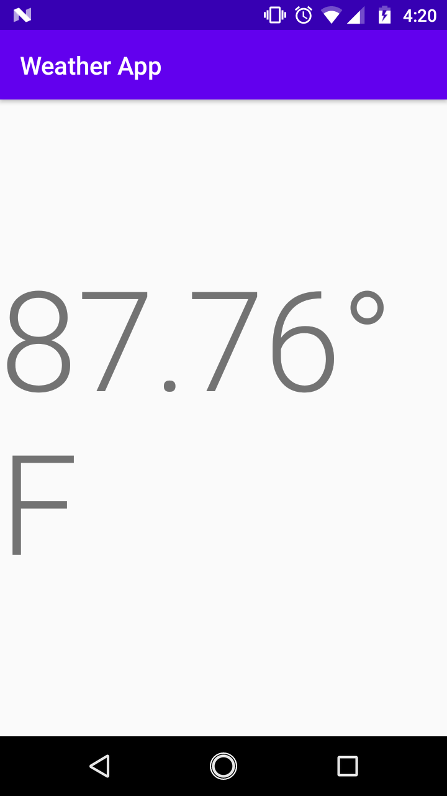
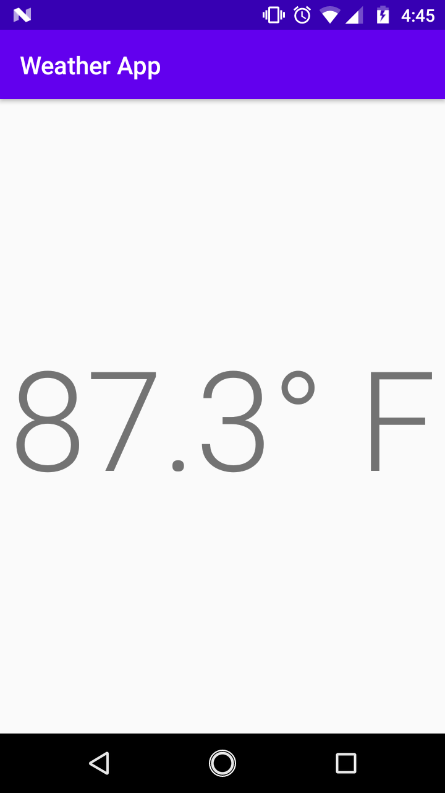

# Getting the forecast

In order to get the forecast data from the internet, we first need to tell Android that we want to use the internet. We need to add a new permission to the `AndroidManifest.xml`.

```xml
<?xml version="1.0" encoding="utf-8"?>
<manifest xmlns:android="http://schemas.android.com/apk/res/android"
    package="com.example.weatherapp">

    <uses-permission android:name="android.permission.ACCESS_COARSE_LOCATION" />
    <!-- NEW! -->
    <uses-permission android:name="android.permission.INTERNET"/>

    <!-- ... -->
</manifest>
```

## OpenWeather API

An [API](https://en.wikipedia.org/wiki/Application_programming_interface) stands for Application Programming Interface. People and companies make API's to allow others (and also themselves) to access their data in a more secure manner.

[openweathermap.org](https://openweathermap.org) offers an API that's free to use (so long as we don't use it too much). We can find it at [https://openweathermap.org/api](https://openweathermap.org/api). Follow their [guide](https://openweathermap.org/appid) to create an account, and get an API key. Then subscribe to the `One Call Api` on the [api list](https://openweathermap.org/api).

The API key they give you will serve as identification when we ask the `openweathermap.org` for the forecast. We're going to need to store it to use it in our application. Create a new file called `Secrets.kt` (no class).

<div class="warning">

If you've set up Git integration, Android Studio will ask if you want to add this file to the repository. This is one of those times where you might **not** want it added.

Secrets are meant to be secret. If your repository is *private*, then it should be no big deal if you add `Secrets.kt` to git. However, if you ever want to make the repo *public*, you'll have to remove the file from git **and** reset all your API keys and whatever other secret data you included.

If you reject adding the file to Git, the filename will remain read. If you want it to stop being red you can right click the file and go to `Git | Add to .gitignore | app/.gitignore`.

</div>

In `Secrets.kt` add a constant for the API key.

```kotlin
package com.example.weatherapp

const val WEATHER_API_KEY = "YOUR API KEY HERE"
```

We'll use this value soon.

## Getting data from an API (Retrofit)

Now we need some way to access data on the internet. There are many solutions to this problem, but we are going to use a library called [Retrofit](https://square.github.io/retrofit/). We're going to add some new dependencies to our `build.gradle`.

```groovy
dependencies { 
    // ...

    // Retrofit
    implementation "com.squareup.retrofit2:retrofit:2.5.0"
    implementation "com.squareup.retrofit2:converter-gson:2.5.0"
    implementation 'com.jakewharton.retrofit:retrofit2-kotlin-coroutines-adapter:0.9.2'
}
```

We're going to be using [coroutines](https://kotlinlang.org/docs/reference/coroutines/coroutines-guide.html) to make our job simpler, so we'll some more dependencies.

```groovy
dependencies {
    // ...

    // Kotlin coroutines
    implementation "org.jetbrains.kotlinx:kotlinx-coroutines-core:1.1.1"
    implementation "org.jetbrains.kotlinx:kotlinx-coroutines-android:1.1.1"
}
```

Once your project's synced, it's time to get into the code. Create a new Kotlin file called `WeatherApi`. It will contain an `interface` also called `WeatherApi`.

```kotlin
package com.example.weatherapp

interface WeatherApi {
}
```

We're going to use [annotations](https://kotlinlang.org/docs/reference/annotations.html) that `Retrofit` provides on a method called `getForecast()` to tell `Retrofit` how to access the OpenWeather API.

```kotlin
// ...

import kotlinx.coroutines.Deferred
import retrofit2.http.GET
import retrofit2.http.Query

interface WeatherApi {
    // Tell Retrofit where to get the data
    @GET("data/2.5/onecall?appid=${WEATHER_API_KEY}&exclude=hourly,minutely")
    fun getForecast(
        // The parameters in the function will be used as
        // query parameters in the resulting url
        @Query("lat") lat: Double,
        @Query("lon") lon: Double,
        // This controls what units the temperature will be in:
        // * Farenheit
        // * Celcius
        // * Kelvin (the default)
        // We're specifying "imperial" to use Farenheit
        @Query("units") units: String = "imperial"

    // We want to use coroutines, so we use Deferred here
    ): Deferred<ForecastData>
}
```

The `ForecastData` class hasn't been created yet. Let's do that now.

```kotlin
// ...

interface WeatherApi {
    // ...
}

// NEW!
data class ForecastData(
    val lat: Double,
    val lon: Double,
    val timezone: String,
    val current: ForecastDetails
)

// NEW!
data class ForecastDetails(
    val dt: Long,
    val temp: Double,
    val feels_like: Double,
    val weather: List<WeatherData>
)

// NEW!
data class WeatherData(
    val id: Int,
    val main: String,
    val description: String,
    val icon: String
)
```
<div class="note">

These classes are based on the JSON returned by [https://openweathermap.org/api/one-call-api](https://openweathermap.org/api/one-call-api). I've left out a lot of fields that the JSON provides. We currently only really need the ones I've specified.

</div>

All we've done is specify the structure of our API. Now we need to use Retrofit to create it. We only want to create the API once, so we'll use an `object` to do that. We'll use `WeatherApi`'s `companion object` just to keep things simple.

```kotlin
import com.jakewharton.retrofit2.adapter.kotlin.coroutines.CoroutineCallAdapterFactory
// ...
import retrofit2.converter.gson.GsonConverterFactory
// ...

interface WeatherApi {
    companion object {
        // Start building Retrofit
        private val retrofit = Retrofit.Builder()
            // Retrofit requires a baseUrl
            .baseUrl("https://api.openweathermap.org/")
            // This will convert the JSON blob we get
            // from OpenWeatherMap into 
            .addConverterFactory(GsonConverterFactory.create())
            // This allows our getForecast() method
            // to return Deferred<*>. Normally it would
            // expect Retrofit's Call<*> class.
            .addCallAdapterFactory(CoroutineCallAdapterFactory())
            // Finish the build process
            .build()

        // Create the actual service using our WeatherApi
        // interface.
        val service: WeatherApi = retrofit.create(WeatherApi::class.java)
    }
}
```

## Using WeatherApi

Now that we've created a service with Retrofit, it's time to us it. Fortunately the only change we need to make is in `WeatherViewModel`.

```kotlin
// ...
import androidx.lifecycle.viewModelScope
import kotlinx.coroutines.Dispatchers
import kotlinx.coroutines.launch
import kotlinx.coroutines.withContext

class WeatherViewModel: ViewModel() {
    fun getForecast(latitude: Double, longitude: Double): LiveData<WeatherModel> {
        val result = MutableLiveData<WeatherModel>()

        // UPDATED!
        // Tells Android to launch a coroutine that will
        // be canceled if the app is destroyed
        viewModelScope.launch {
            // Switch to an IO context. Make web requests
            // on the UI thread will cause the app to
            // crash.
            result.value = withContext(Dispatchers.IO) {
                val forecast = WeatherApi.service
                    // The .await() bit is important. A
                    // Deferred object needs to be awaited
                    // before we can get any value from it.
                    // This is because the value has not 
                    // been retrieved yet because it's
                    // coming from the internet.
                    .getForecast(latitude, longitude)
                    .await()

                // The last value in a lambda will be
                // the return value. This is what
                // `result.value` will be set to.
                WeatherModel(forecast.current.temp)
            }
        }

        return result
    }
}
```

That should be everything. You should be seeing the current temperature in your location.



The `F` being on the next line is annoying. We can fix that by making the text smaller, or you can format the text so it only includes one decimal place. I chose to do the latter.

```kotlin
private fun getLocation() {
    fusedLocationProviderClient.lastLocation
        .addOnSuccessListener { location ->
            val viewModel: WeatherViewModel by viewModels()
            viewModel.getForecast(location.latitude, location.longitude)
                .observe(this, Observer { forecast ->
                    // UPDATED!
                    temperatureText.text = "%.1f° F".format(forecast.temperature)
                })
        }
        .addOnFailureListener {
            Toast.makeText(this, "Unable to retrieve users location", Toast.LENGTH_SHORT).show()
        }
}
```

<div class="note">

I'm using [printf style formatting](https://www.cplusplus.com/reference/cstdio/printf/). A `%f` means put a float (or double in our case) here. `%.1f` means put a float here with one number after the decimal point.

</div>

