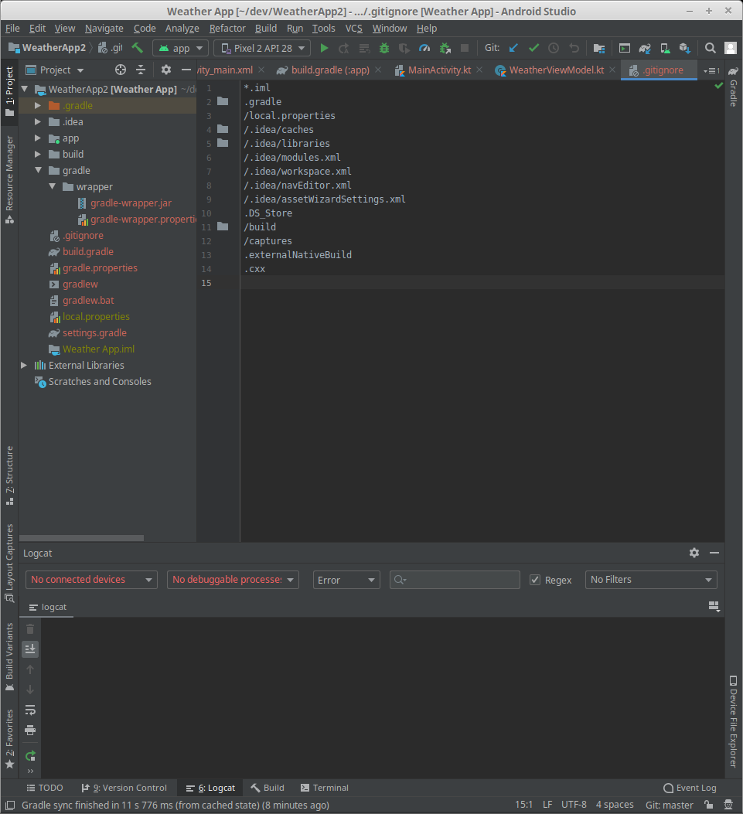
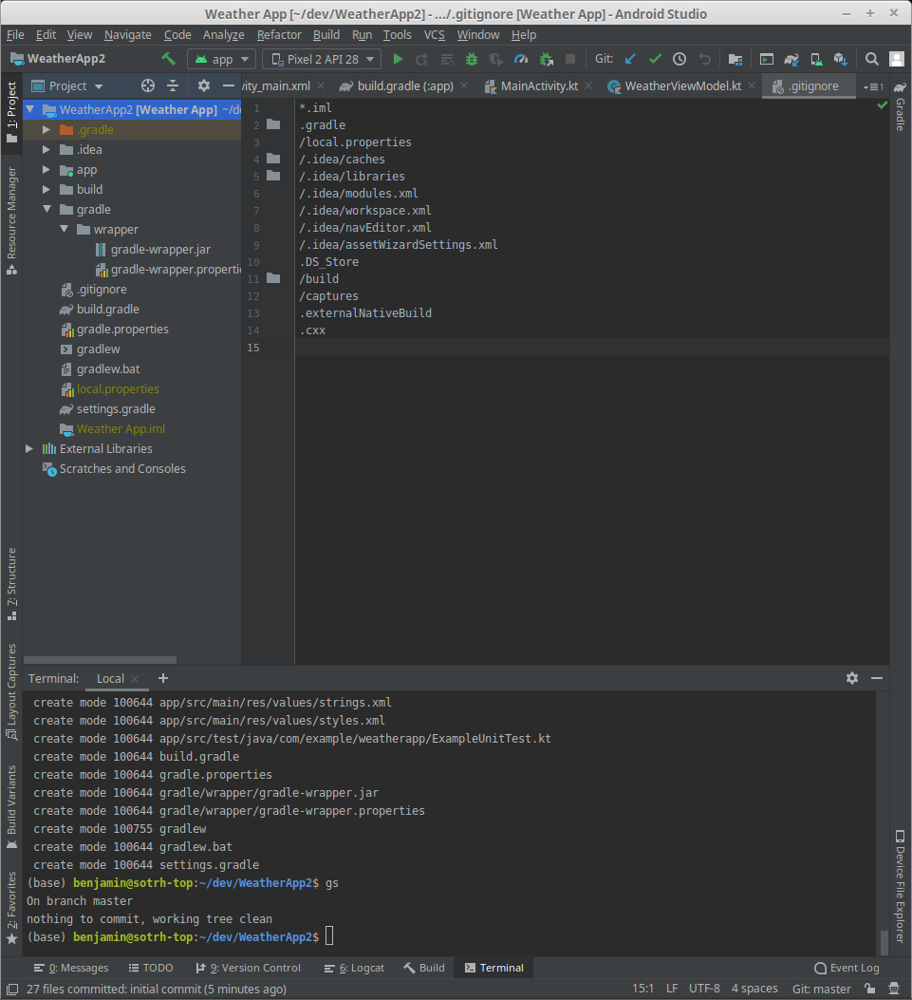

# Git Integration

While I said we were going to get the forecast next. I'm going to take a tangent to talk about using Git with Android Studio.

<div class="note">

If you want to learn a bit more about Git itself, checkout the [Git Guide](/git/).

</div>

We can tell Android Studio to use Git by using the `VCS | Import into Version Control | Create Git Repository..`. Once you've done that, all your filenames will change colors. On top of that a new `.gitignore` file will have been created.



<div class="note">

I used the `Project` view for this screen shot, as the `Android` view doesn't show the `.gitignore` file.

</div>

The *gold* filenames means that Git is ignoring the file. The *red* filenames are files that Git can see, but haven't been added to the repository.

We can access git operations by right clicking on a file/directory and navigating to the git section. I prefer using a terminal however. The terminal should be at the bottom of the Android Studio window.

When the terminals opened, add all the files in the project to the git repo.

```bash
git add .
```

The red filenames should turn green. Then commit the project.

```bash
git commit -m 'initial commit'
```

Your files should now be normal colored.



If you create a new file, Android Studio should prompt ask you if you want it to be added to the git repo. You should usually say yes, unless you have an actual reason to say no. As always you can add/remove files from Git from the command line.
