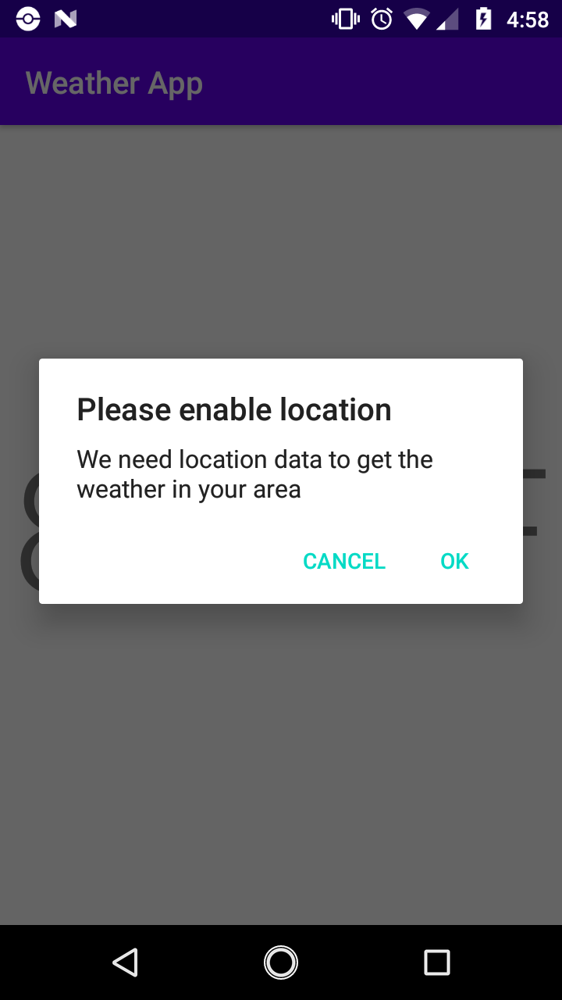
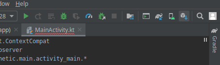
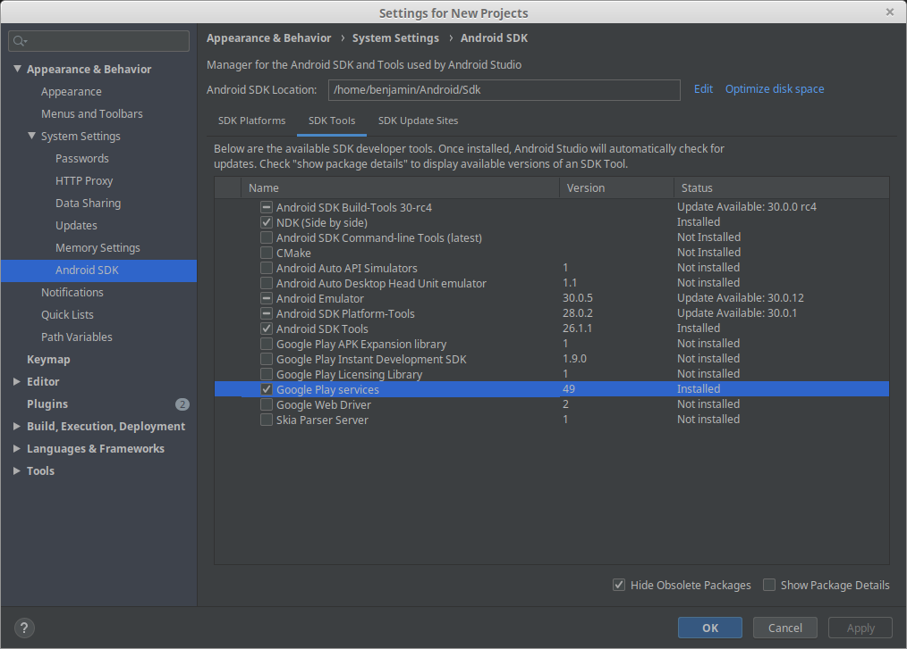

# Getting the devices location

In order to get the weather at the devices current location, we first need to get the location itself. Before we do that, we need to give our device persmission to use location data at all.

## Permissions and location

Permissions are Android's way of telling users what features of your device an app wants to use. If an app wants to access location data, it has to do 2 things.

1. Declare that it wants to use `ACCESS_COARSE_LOCATION` and/or `ACCESS_FINE_LOCATION` in the `AndroidManifest.xml`.

2. Request permission from the user directly before using the location data for the first time.

Lets tackle the first thing on our todo list. Add the `ACCESS_COARSE_LOCATION` permission to the `manifest` block of `AndroidManifest.xml` using the `<uses-permission>` tag.

```xml
<?xml version="1.0" encoding="utf-8"?>
<manifest xmlns:android="http://schemas.android.com/apk/res/android"
    package="com.example.weatherapp">

    <uses-permission android:name="android.permission.ACCESS_COARSE_LOCATION" />

    <!-- application block... -->

</manifest>
```

<div class="note">

The `ACCESS_COARSE_LOCATION` permission is used for city block level location data. You need to use `ACCESS_FINE_LOCATION` if you want to get the users exact location. For weather, we don't really need much precision, so `ACCESS_COARSE_LOCATION` is just fine. You can check out more in the [docs](https://developer.android.com/training/location/permissions)

</div>

## Asking the user for permission

Step 2 on our todo list requires some actual code. In our `MainActivity`, in the `onCreate()` function, we need to check if our user has already given us permission to use location data.

```kotlin
package com.example.weatherapp

import android.Manifest // NEW!
import android.content.pm.PackageManager // NEW!
// ...
import androidx.core.content.ContextCompat // NEW!
// ...

class MainActivity : AppCompatActivity() {

    override fun onCreate(savedInstanceState: Bundle?) {
        super.onCreate(savedInstanceState)
        setContentView(R.layout.activity_main)

        // NEW!
        when {
            ContextCompat.checkSelfPermission(
                this,
                Manifest.permission.ACCESS_COARSE_LOCATION
            ) == PackageManager.PERMISSION_GRANTED-> {
                getLocation()
            }
        }

        // ...
    }

    // ...
}
```

<div class="note">

We used `ContextCompat.checkSelfPermission()`, but we could have used just `checkSelfPermission()`. Doing this however would limit what devices could use our app as `checkSelfPermission()` is a newer method that older versions of Android don't have. `ContextCompat` bridges the gap for us so we don't run into that issue.

</div>

The `getLocation()` method doesn't exist yet. We'll create it in `MainActivity`.

```kotlin
class MainActivity : AppCompatActivity() {
    override fun onCreate(savedInstanceState: Bundle?) {
        //...
    }

    private fun getLocation() {

    }
}
```

If the user hasn't given us permission to use location data, we need to check to see if we've already asked them for it.

```kotlin
package com.example.weatherapp

import android.Manifest
import android.content.pm.PackageManager
// ...
import androidx.core.app.ActivityCompat // NEW!
import androidx.core.content.ContextCompat
// ...

class MainActivity : AppCompatActivity() {

    override fun onCreate(savedInstanceState: Bundle?) {
        super.onCreate(savedInstanceState)
        setContentView(R.layout.activity_main)

        when {
            ContextCompat.checkSelfPermission(
                this,
                Manifest.permission.ACCESS_COARSE_LOCATION
            ) == PackageManager.PERMISSION_GRANTED-> {
                getLocation()
            }
            // NEW!
            ActivityCompat.shouldShowRequestPermissionRationale(
                this,
                Manifest.permission.ACCESS_COARSE_LOCATION
            ) -> {
                showLocationRequestUI()
            }
        }

        // ...
    }

    // ...
}
```

<div class="note">

`ActivityCompat` serves a similar purpose to `ContextCompat`, but specifically for classes that inherit from `Activity`. `MainActivity` is both a `Context` and an `Activity`.

</div>

Like `getLocation()`, `showLocationRequestUI()` doesn't exist yet, so we'll create it below.

```kotlin
class MainActivity : AppCompatActivity() {
    override fun onCreate(savedInstanceState: Bundle?) {
        //...
    }

    private fun getLocation() {

    }

    // NEW!
    private fun showLocationRequestUI()  {

    }
}
```

Finally, we need to handle the case that the user hasn't given us permission, but we don't need to tell them why we need permission.

```kotlin
package com.example.weatherapp

import android.Manifest
import android.content.pm.PackageManager
// ...
import androidx.core.app.ActivityCompat
import androidx.core.content.ContextCompat
// ...

class MainActivity : AppCompatActivity() {

    override fun onCreate(savedInstanceState: Bundle?) {
        super.onCreate(savedInstanceState)
        setContentView(R.layout.activity_main)

        when {
            ContextCompat.checkSelfPermission(
                this,
                Manifest.permission.ACCESS_COARSE_LOCATION
            ) == PackageManager.PERMISSION_GRANTED-> {
                getLocation()
            }
            ActivityCompat.shouldShowRequestPermissionRationale(
                this,
                Manifest.permission.ACCESS_COARSE_LOCATION
            ) -> {
                showLocationRequestUI()
            }
            // NEW!
            else -> {
                requestLocationPermission()
            }
        }

        // ...
    }

    // ...
}
```

Yet again, `requestLocationPermission()` doesn't exist yet. This time it will actually do something.

```kotlin
class MainActivity : AppCompatActivity() {
    // ...

    private fun requestLocationPermission() {
        ActivityCompat.requestPermissions(
            this,
            arrayOf(Manifest.permission.ACCESS_COARSE_LOCATION),
            LOCATION_REQUEST_CODE
        )
    }
}
```

The `ActivityCompat.requestPermissions()` method takes 3 parameters.

1. The activity the request is being preformed on in our case `this` (referring to `MainActivity`).
2. An array of permission strings that we want the user to give us access to.
3. An `Int` request code that we'll use to see if our request was granted.

The `LOCATION_REQUEST_CODE` value is a custom value that we are going to create. Above `class MainActivity` add the following.

```kotlin
const val LOCATION_REQUEST_CODE = 0
```

<div class="note">

We could just use `0` in `requestPermissions()`, but using a named value will be easier when we get our permissions result back.

</div>

## onRequestPermissionsResult

Once we send of a permissions request, eventually Android will call the `onRequestPermissionsResult()` method on our `MainActivity`. We're not currently overriding `onRequestPermissionsResult()`, so we'll need to do that to actual see the result. Press `Ctrl + O`, find `onRequestPermissionsResult` and once it generates, modify it to check for our permission.

```kotlin
override fun onRequestPermissionsResult(
    requestCode: Int,
    permissions: Array<out String>,
    grantResults: IntArray
) {
    when (requestCode) {
        LOCATION_REQUEST_CODE -> {
            // Check if we have permission
            if (grantResults.isNotEmpty() && grantResults[0] == PackageManager.PERMISSION_GRANTED) {
                getLocation()
            } else {
                showLocationDeniedUI()
            }
        }
        else -> {}
    }
}
```

The `when` statement (check out [the docs](https://kotlinlang.org/docs/reference/control-flow.html#when-expression) to learn more about `when` statments), checks the `requestCode` parameter to see if it matchs a certain criteria.

<div class="note">

You can see we're using the `LOCATION_REQUEST_CODE` from earlier. If we needed to request multiple permissions, we would need to create multiple request codes.

</div>

If the `requestCode` is the same as our `LOCATION_REQUEST_CODE`, we can check to see if our permission is granted.

The `grantResults` is an [array](https://kotlinlang.org/docs/reference/basic-types.html#arrays) of `Int`s. These `Int`s will be values from `PackageManager`. The only value we care about though is `PackageManager.PERMISSION_GRANTED`.

We haven't created `showLocationDeniedUI()` so create below the others.

```kotlin
class MainActivity : AppCompatActivity() {
    // ...

    private fun showLocationDeniedUI() {

    }
}
```

## showLocationRequestUI()

This method should tell to user *why* we need permission to use their location, and give them the option to accept  or deny our request. There are many ways make this kind of UI, but for simplicities sake, we're going to use an `AlertDialog`. An `AlertDialog` is a popup that has a title, message, and some buttons that the user can interact with to do different things in our app. We're going to create and display an `AlertDialog` in `showLocationRequestUI()`.

```kotlin
// ...
import androidx.appcompat.app.AlertDialog
// ...

class MainActivity : AppCompatActivity() {
    // ...
    private fun showLocationRequestUI() {
        AlertDialog.Builder(this)
            .setTitle("Please enable location")
            .setMessage("We need location data to get the weather in your area")
            // This will be called when the user clicks off the alert dialog
            .setOnCancelListener {
                showLocationDeniedUI()
            }
            // This will create a Cancel button
            .setNegativeButton("Cancel") { _, _ ->
                showLocationDeniedUI()
            }
            // This will create an Ok button
            .setPositiveButton("Ok") { _, _ ->
                requestLocationPermission()
            }
            .create()
            .show()
    }
}
```

<div class="note">

The `_, _ ->` bit in `setNegativeButton()` and `setPositiveButton()` indicate that these lambdas normally take 2 parameters. We can use an `_` to ignore parameters in a lambda.

</div>
<div class="warning">

Make sure that you deny location access when you first run the app. `showLocationRequestUI()` will only run when `ActivityCompat.shouldShowRequestPermissionRationale()` is `true` which will only happen if the user has denied location data at least once.

If you din't deny the permission, you can uninstall the app, or go into the app settings to remove the permission. Then you can run the app again.

</div>

You should get something like this when the method is called.



Hitting the OK button will run `requestLocationPermission()`.

Now that we have the users permission to access their location, let's actually get their location. We're going to need some things first though.

## Google Play Services

The simplest way to get location data is through Google Play Services. We need to download them through Android Studio's SDK Manager.

<div class="note">

You can find the sdk manager by clicking the cube with a down arrow. You'll find it in the top left of the Android Studio window.



You can also find it under `Tools | SDK Manager`.

</div>

Once the SDK Manager is open, switch to the SDK Tools tab. Then check the Google Play services option.



Click OK once you've done that, and Android Studio will install Google Play services if it hasn't already.

## FusedLocationProviderClient

One of the things Google Play Services provides, is a class called [FusedLocationProviderClient](https://developers.google.com/android/reference/com/google/android/gms/location/FusedLocationProviderClient). We'll use this to get access to our location data. We need to add it to our `build.gradle` first.

```groovy
dependencies {
    // ...
    implementation "com.google.android.gms:play-services-location:17.0.0"
}
```

<div class="note">

I used [https://developers.google.com/android/guides/setup](https://developers.google.com/android/guides/setup) to find this dependencies, and you can find other Google Play Services dependencies there as well.

</div>

Now we can use the `FusedLocationProviderClient` in our application. We're going to create a field on `MainActivity` to store our `fusedLocationProviderClient`, which will set in `onCreate()`.

```kotlin
// ...
import com.google.android.gms.location.FusedLocationProviderClient
import com.google.android.gms.location.LocationServices
// ...

class MainActivity : AppCompatActivity() {

    lateinit var fusedLocationProviderClient: FusedLocationProviderClient

    override fun onCreate(savedInstanceState: Bundle?) {
        super.onCreate(savedInstanceState)
        setContentView(R.layout.activity_main)

        fusedLocationProviderClient = LocationServices.getFusedLocationProviderClient(this)

        // ...
    }

    // ...
}
```

<div class="note">

We use a `lateinit var` because the `fusedLocationProviderClient` can change as the application is running. We could have just used a `var`, but Kotlin requires that all `var`s (and `val`s) be created with a value. That would mean we'd have to do something like this.

```kotlin
var fusedLocationProviderClient: FusedLocationProviderClient? = null
```

This would require that we check if `fusedLocationProviderClient` is `null` everytime we tried to use it.

</div>

We can now **finally** get our user's location.

## getLocation()

Update the `getLocation()` method to as shown.

```kotlin
private fun getLocation() {
    fusedLocationProviderClient.lastLocation
        .addOnSuccessListener { location ->
            // TODO
        }
        .addOnFailureListener { 
            Toast.makeText(this, "Unable to retrieve users location", Toast.LENGTH_SHORT).show()
        }
}
```

Here we get the `lastLocation` from the `fusedLocationProviderClient`. The `lastLocation` is a `Task<Location>`. `Task<*>` values have a few methods on them that we can use to run code when the task is completed (or failed).

`addOnFailureListener()` will execute if the `lastLocation` task fails for whatever reason. We simply just display a message to the user that a failure occured.

`addOnSuccessListener()` takes in a lambda with one parameter: `location`. That's the location we need to tell our `WeatherViewModel` what location to use when it eventually gets the forecast. Move the `viewModel` code from `onCreate()` to here.

```kotlin
.addOnSuccessListener { location ->
    val viewModel: WeatherViewModel by viewModels()
    viewModel.getForecast()
        .observe(this, Observer { forecast ->
            temperatureText.text = "${forecast.temperature}° F"
        })
}
```

We need to change `getForecast()` to use our location.

```kotlin
class WeatherViewModel: ViewModel() {
    fun getForecast(latitude: Double, longitude: Double): LiveData<WeatherModel> {
        val result = MutableLiveData<WeatherModel>()
        result.value = WeatherModel(82.0)
        return result
    }
}
```

<div class="note">

We're using `latitude` and `longitude` seperately here, because we can create a `Location` object ourselves. If the user doesn't give us permission to use their location, it would be good for us to display some random location instead.

</div>

With that in place we need to update our call as well

```kotlin
.addOnSuccessListener { location ->
    val viewModel: WeatherViewModel by viewModels()
    viewModel.getForecast(location.latitude, location.longitude) // UPDATED!
        .observe(this, Observer { forecast ->
            temperatureText.text = "${forecast.temperature}° F"
        })
}
```

## Using the users location

We're going to save getting the actual forecast for next time, but for now let's return the user's `latitude` as the temperature value just so we can see things are working.

```kotlin
class WeatherViewModel: ViewModel() {
    fun getForecast(latitude: Double, longitude: Double): LiveData<WeatherModel> {
        val result = MutableLiveData<WeatherModel>()
        result.value = WeatherModel(latitude) // UPDATED!
        return result
    }
}
```

With that you should have a long number for your temperature.
