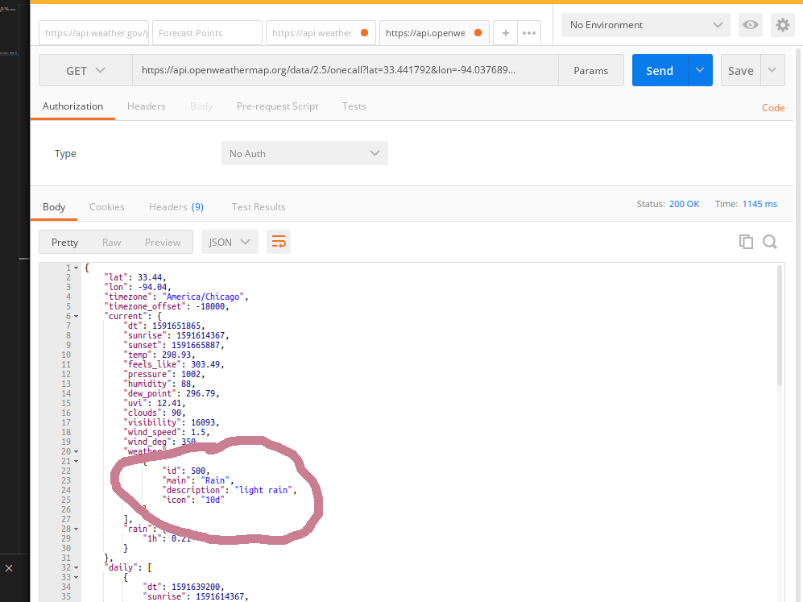
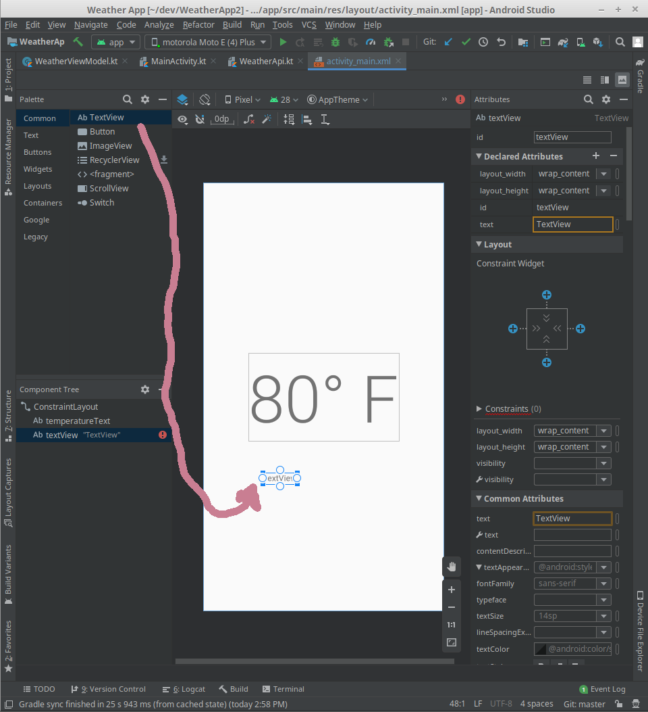
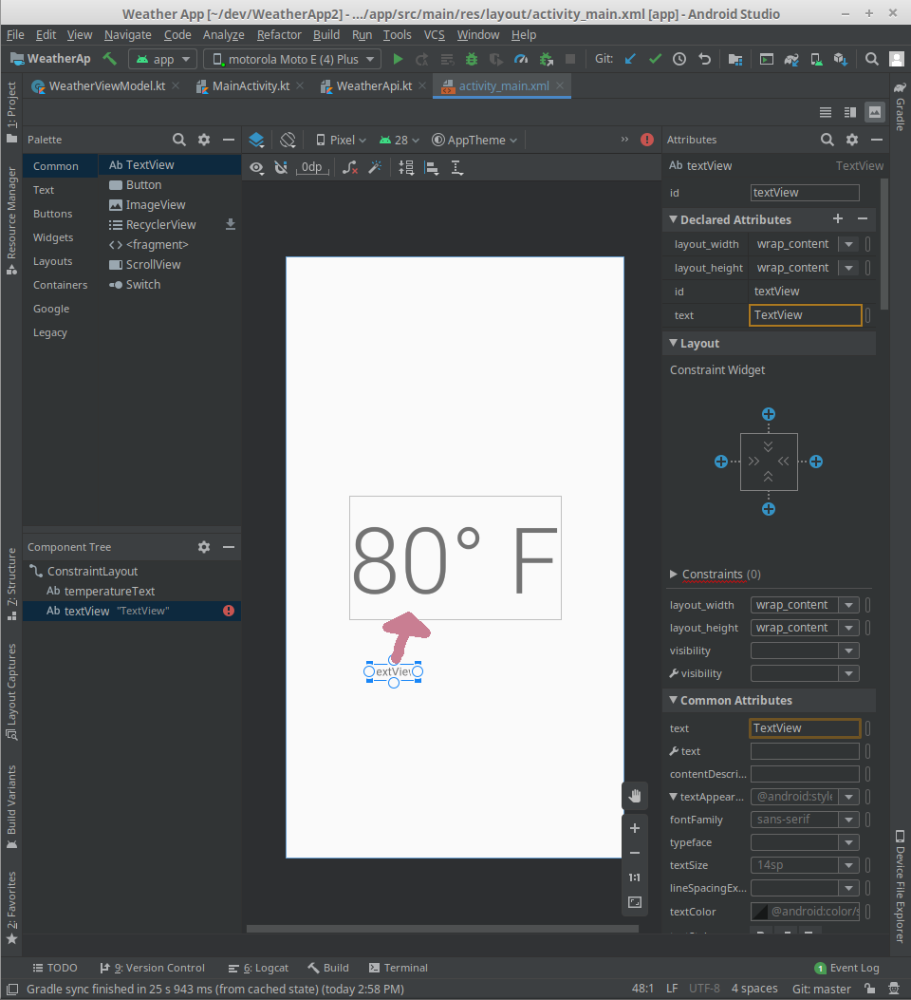
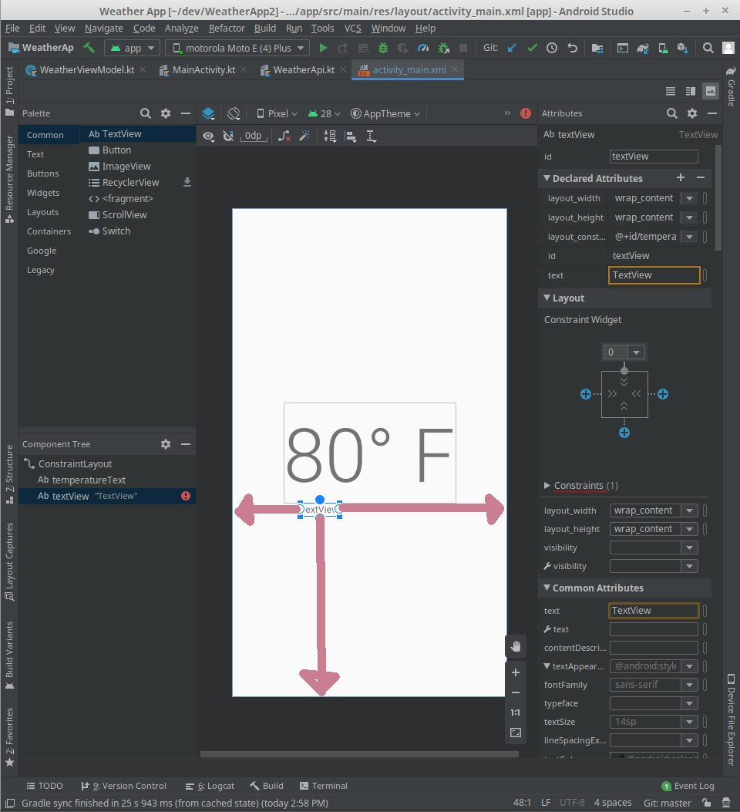
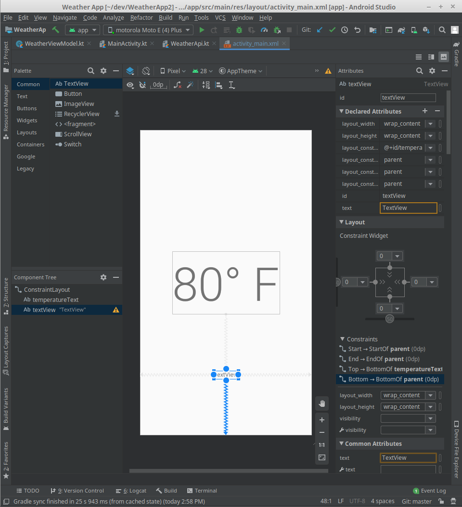
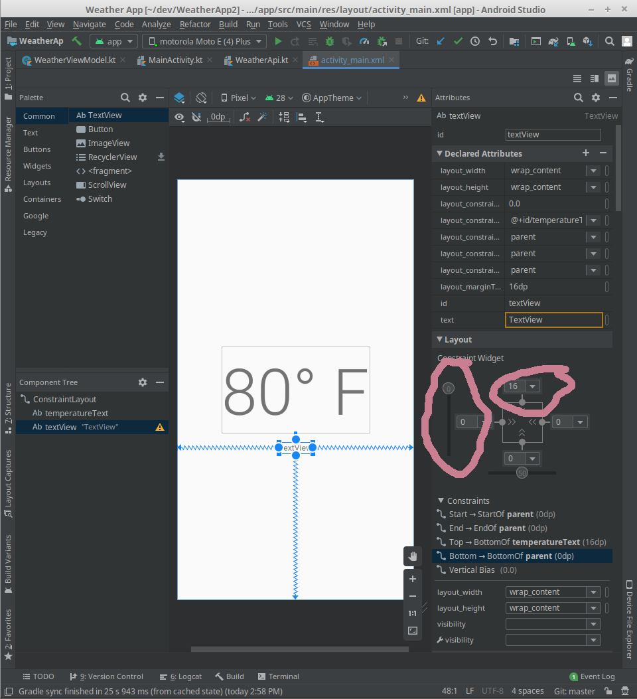
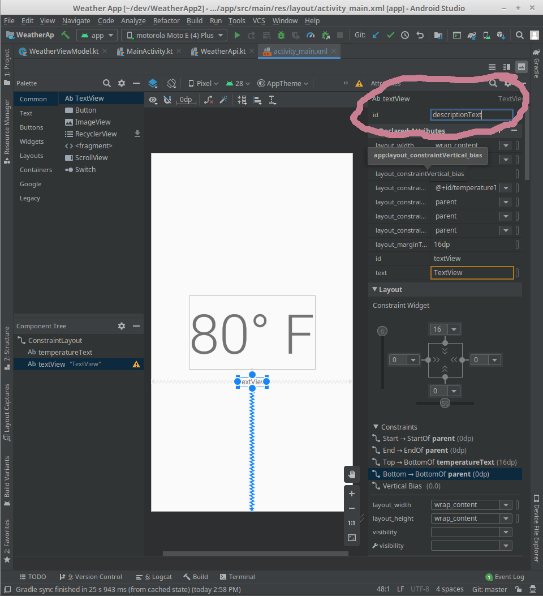
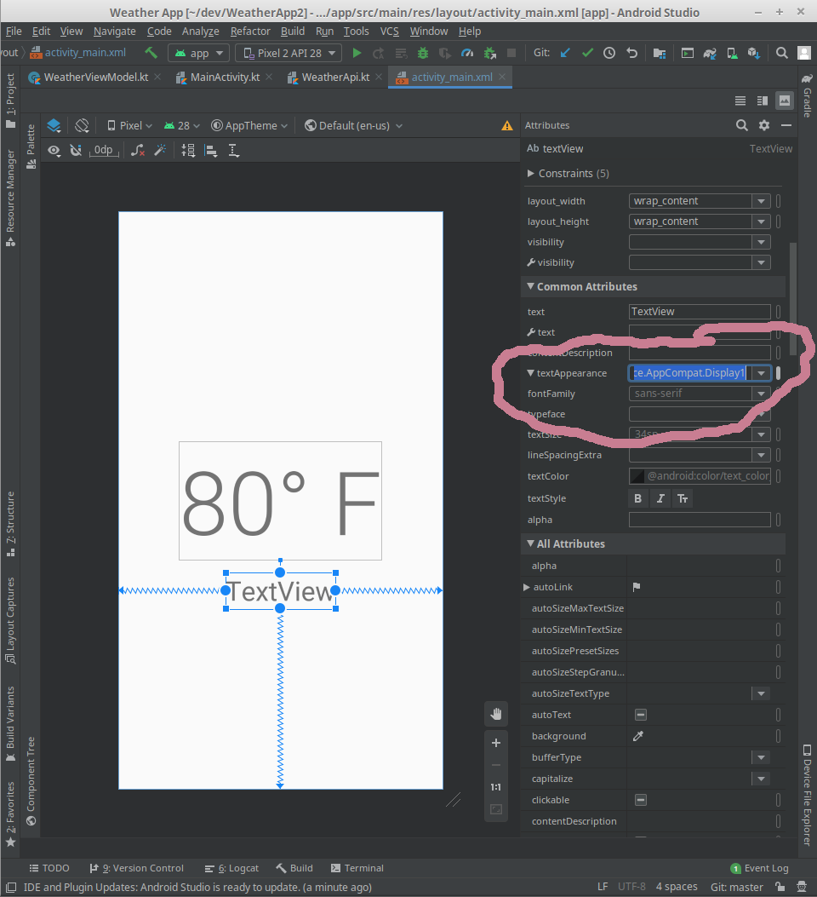
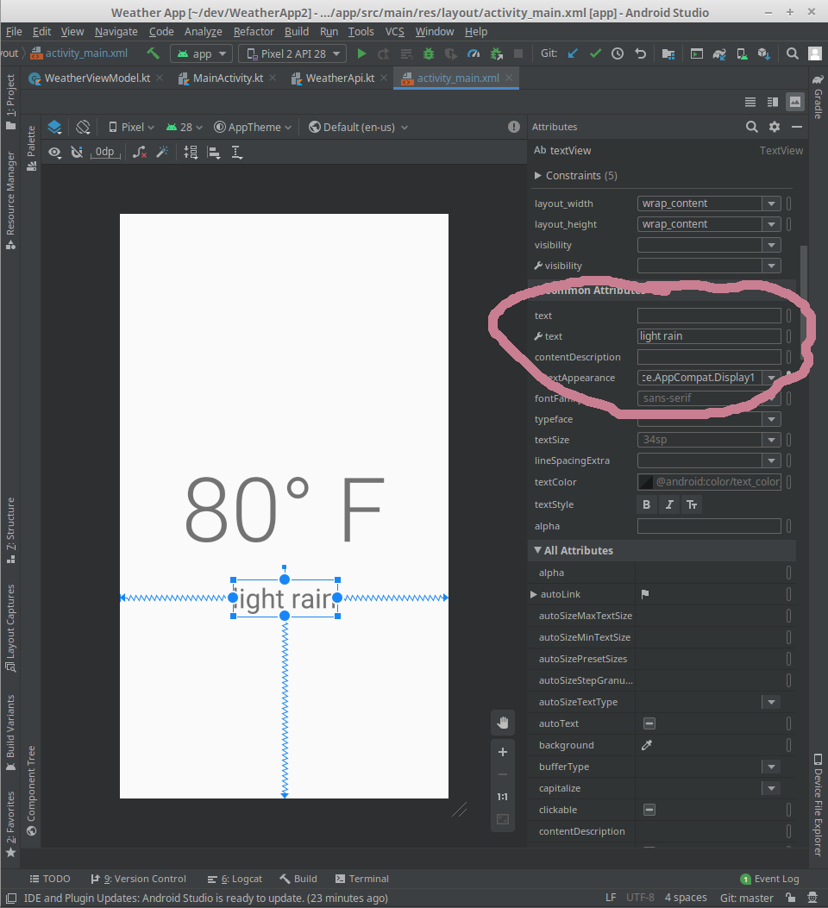

# Adding More Data

Up to this point we've only displayed the local temperature. If we look at our `WeatherApi` data classes, we have a lot more data available to us.

```kotlin
// ...
data class ForecastData(
    val lat: Double,
    val lon: Double,
    val timezone: String,
    val current: ForecastDetails
)

data class ForecastDetails(
    val dt: Long,
    val temp: Double,
    val feels_like: Double,
    val weather: List<WeatherData>
)

data class WeatherData(
    val id: Int,
    val main: String,
    val description: String,
    val icon: String
)
```

I'm particularly interested in the `description` field. If we look at the JSON response to our api call in [Postman](https://www.postman.com/)



we can see that the `description` has the value `light rain`. Let's display that.

## Adding a description text

In `activity_main.xml` drag a `TextView` into the layout.



Click and drag the top bubble on the `TextView` to the bottom of our `temperatureText`.



Then constrain
1. Constrain the left bubble to the left edge of the layout.
2. Constrain the right bubble to the right edge of the layout.
3. Constrain the bottom bubble to the bottom of the layout.



It should look something like this.



Then will adjust the vertical bias, to be to the top by shifting the slider up. We'll also set the top margin to 16.



We'll change the id of our `TextView` to `descriptionText`.



Then change the `textAppearance` to be `Display1`.



Finally empty the `text` field and set the tool text field to be `light rain`.

