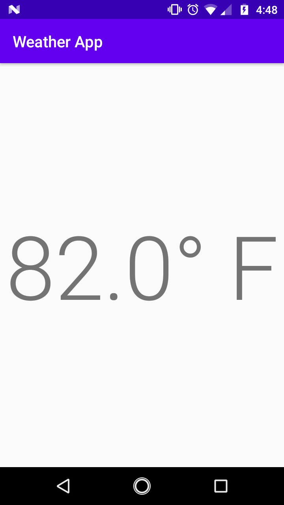

# MVVM

Short for Model View ViewModel, the MVVM pattern is the default for modern Android applications. It describes the relationship and transfer of data within the application.

## Model

The first M in MVVM, the model describes the raw data that your application needs, and also how to access it. Data from a SQL database, or an external server are examples of model data.

The model code serves as a source for the all the data in the application (with exception to sensor data, or data created by the view itself).

In our app, the model will be forecast data. Eventually we will be pulling this data from the internet, but for now will just mock it up.

Right click the folder containing `MainActivity` and select `New | Kotlin File/Class`. Name it `WeatherModel`, leaving the options as default. That should create a new file next to `MainActivity` called `WeatherModel.kt`. It's contents should look like this.

```kotlin
package com.example.weatherapp

```

Now we are going to create a [data class](https://kotlinlang.org/docs/reference/data-classes.html) called `WeatherModel` (the same name as the file).

```kotlin
data class WeatherModel(
    val temperature: Double
)
```

We only have one field in this class: `temperature`. We'll add more later when we start pulling data from the internet. For now this is all we need.

## View

The 2nd letter in MVVM, the view is all the code that deals with the visual aspect of the application. In other words, what the user "views". Activities (such as `MainActivity`), and layouts are part of the view code.

We've already messed with view code when we set the `text` of `temperatureText` in `onCreate`.

## ViewModel

The view model is the last 2 letters of MVVM. It's responsible for requesting data from the model, and providing it to the view. 

Let's create a new file called `WeatherViewModel` in the same way you created `WeatherModel`. In the file you just created, create a class called `WeatherViewModel` that will inherit from `ViewModel`.

```kotlin
package com.example.weatherapp

import androidx.lifecycle.ViewModel

class WeatherViewModel: ViewModel() {
}
```

We can create our `WeatherViewModel` in the `onCreate` of `MainActivity` using the `ViewModels()` delegate function.

```kotlin
package com.example.weatherapp

import androidx.appcompat.app.AppCompatActivity
import android.os.Bundle
// NEW!
import androidx.activity.viewModels
import kotlinx.android.synthetic.main.activity_main.*

class MainActivity : AppCompatActivity() {

    override fun onCreate(savedInstanceState: Bundle?) {
        super.onCreate(savedInstanceState)
        setContentView(R.layout.activity_main)

        // NEW!
        val viewModel: WeatherViewModel by viewModels()

        temperatureText.text = "81° F"
    }
}
```

The `by` keyword tells kotlin to delegate the creation of `viewModel` to `viewModels()`.

In order to use `viewModels()`, will need to include it in our project. Open up your `build.gradle (Module: app)`, and in the `dependencies` your going to add a new dependency below all the other dependencies.

```groovy
dependencies {
    // ...

    implementation "androidx.activity:activity-ktx:1.1.0"
}
```

You might have an error after doing this. The lowest Java version that our Android project supports is 1.6. The `viewModels()` function can only be used on 1.8 and above. We can fix this by adding some code to the `android` block in `build.gradle`.

```groovy
android {
    compileSdkVersion 28

    compileOptions {
        sourceCompatibility JavaVersion.VERSION_1_8
        targetCompatibility JavaVersion.VERSION_1_8
    }

    kotlinOptions {
        jvmTarget = JavaVersion.VERSION_1_8.toString()
    }

    // ...

}
```

Right now our `WeatherViewModel` doesn't do anything. We're going to fix that by using `LiveData`.

## LiveData

The [LiveData](https://developer.android.com/topic/libraries/architecture/livedata) class is the lynchpin of the MVVM pattern. View code can `observe()` a `LiveData` object, and whenever the `LiveData` changes, the view will be updated.

Create a function called `getForecast()` in `WeatherViewModel` that returns a `LiveData` object with an inner type of our `WeatherModel`.

```kotlin
package com.example.weatherapp

import androidx.lifecycle.LiveData // NEW!
import androidx.lifecycle.ViewModel

class WeatherViewModel: ViewModel() {
    // NEW!
    fun getForecast(): LiveData<WeatherModel> {
        
    }
}
```

Inside of `getForecast()`, create a `val` called `result` and set it `=` to a new `MutableLiveData` object with the inner type of `WeatherModel`. Then return that `result`.

```kotlin
package com.example.weatherapp

import androidx.lifecycle.LiveData
import androidx.lifecycle.MutableLiveData
import androidx.lifecycle.ViewModel

class WeatherViewModel: ViewModel() {
    fun getForecast(): LiveData<WeatherModel> {
        // NEW!
        val result = MutableLiveData<WeatherModel>()
        return result
    }
}
```

The `MutableLiveData` class inherits `LiveData`, so we can return it from `getForecast()` with no issue.

Now we're going to `observe()` our `LiveData` that we get from `getForecast()` inside of `MainActivity`.

```kotlin
package com.example.weatherapp

import androidx.appcompat.app.AppCompatActivity
import android.os.Bundle
import androidx.activity.viewModels
import androidx.lifecycle.Observer // NEW!
import kotlinx.android.synthetic.main.activity_main.*

class MainActivity : AppCompatActivity() {

    override fun onCreate(savedInstanceState: Bundle?) {
        super.onCreate(savedInstanceState)
        setContentView(R.layout.activity_main)

        val viewModel: WeatherViewModel by viewModels()
        // NEW!
        viewModel.getForecast()
            .observe(this, Observer {
            
            })

        temperatureText.text = "81° F"
    }
}
```

The `observe()` method takes 2 parameters.
1. The `LifeCycleOwner` of the `LiveData`. Our `MainActivity` extends `LifeCycleOwner`, so we can use the `this` keyword to pass it in.
2. An `Observer`. This is an object that will be called when the `LiveData` gets updated. We create an `Observer` with the code

```kotlin
Observer {

}
```

Any code between the curly braces will be executed when the `LiveData` updates.

We want to update our `temperatureText` when we get new forecast data. Let's move it into the `Observer {}` block.

```kotlin
// ...

class MainActivity : AppCompatActivity() {

    override fun onCreate(savedInstanceState: Bundle?) {
        // ...

        val viewModel: WeatherViewModel by viewModels()
        viewModel.getForecast()
            .observe(this, Observer {
                temperatureText.text = "81° F"
            })
    }
}
```

## Updating LiveData

If we were to run our app now, we wouldn't see anything. That's because we're creating our `LiveData` `result` in `getForecast()`, but we aren't doing anything with it. Let's change that.

Update `getForecast()` to set the `value` on `result` before we return `result`.

```kotlin
// ...

class WeatherViewModel: ViewModel() {
    fun getForecast(): LiveData<WeatherModel> {
        val result = MutableLiveData<WeatherModel>()
        result.value = WeatherModel(82.0) // NEW!
        return result
    }
}
```

We now need to update our `Observer` to use the value from the `LiveData`.

```kotlin
// In onCreate
viewModel.getForecast()
    .observe(this, Observer {
        temperatureText.text = "${it.temperature}° F"
    })
```

The `it` keyword is the value from the `LiveData` we are observing. The `Observer` is using a [lambda](https://kotlinlang.org/docs/reference/lambdas.html) which is why we have access to `it`. If we wanted to use a name other than it we could do

```kotlin
//         vvvvvvvvvvv
Observer { forecast ->
    temperatureText.text = "${forecast.temperature}° F"
}
```

It's up to preference, but for sake of clarity I'm going to use `forecast` instead of `it`.

The code up to this point should look something like the following.

```kotlin
package com.example.weatherapp

import androidx.appcompat.app.AppCompatActivity
import android.os.Bundle
import androidx.activity.viewModels
import androidx.lifecycle.Observer
import kotlinx.android.synthetic.main.activity_main.*

class MainActivity : AppCompatActivity() {

    override fun onCreate(savedInstanceState: Bundle?) {
        super.onCreate(savedInstanceState)
        setContentView(R.layout.activity_main)

        val viewModel: WeatherViewModel by viewModels()
        viewModel.getForecast()
            .observe(this, Observer { forecast ->
                temperatureText.text = "${forecast.temperature}° F"
            })
    }
}
```

You should have something like the following on your device.



Next time we'll discuss getting the devices physical location which we will eventually use to get the actually forecast.