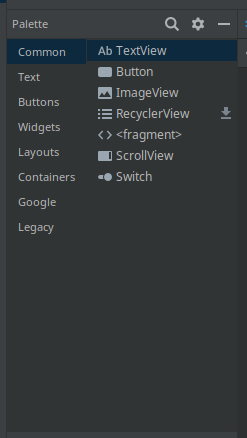

# Creating a new project

First things first, install [Android studio](https://developer.android.com/studio/) on your computer if you haven't already (the Makerspace machines should have it installed). The installation instructions are pretty straight forward, so I won't reiterate them here.

Once that's done, we can create our project. If you haven't opened Android Studio before, you should see a welcome screen. Click the new project button. If that's not the case go to `File | New | New Project`.

You should see a `Select a Project Template` screen.


Select the `Empty Activity` option and hit next. The next screen will ask for the projects name, and some other information.


Set the name of the project as `Weather App`. You can leave the others as they are.

The Package name field deserves some explanation. In Java and Kotlin a package defines the location that code will be stored in when the project is created. It's also used as an ID to differentiate your app from other apps.

The package is usually the developer or companys domain backwards, followed by the lowercase app name with no spaces. For example if I was creating a weather app for Telos, I would use `org.telos.weatherapp`.

Now click finish, and Android Studio will create your project.

## A tour of your new project

Once Android Studio has finished building an syncing your project, you should see 2 folders in the Project Window. *You might need to wait awhile.*


### The app folder

The `app` folder is where we build our app. It's split up into 3 sub folders: `manifests`, `java`, and `res`.

1. The `manifests` folder only has one file: `AndroidMainifest.xml`. This file contains configuration data for our app such as what icon to use, and what the app should be called.
2. The `java` folder should have 3 sub folders. The name of these folders will be the package name you specified when you created the project. The first one is for the main app code, the second to are for testing code. We'll stick to the first folder for now.
3. The `res` folder holds all our resources. Theres quite a lot in here, so I won't go into much detail here, as we'll get into most of these when we need them.

The `Gradle Scripts` folder is a virtual folder. It holds the build files that we'll use the add things to our project. We won't need to add any new files to this folder, but we will be modifying `build.gradle (Module: app)` later on.

## Activities and MainActivity

In the `app/java/<package_name>/` folder, there should be one file: `MainActivity`. This is the starting point for our app. An activity represents a single chunk of an Android app. Every app needs at least one activity. Let's look at it piece by piece.

```kotlin
package com.example.weatherapp
```

This is the same as the package name we created earlier. All kotlin files need a package name that matches where they are in the `java` folder. Android Studio is pretty good about creating these for you.

```kotlin
import androidx.appcompat.app.AppCompatActivity
import android.os.Bundle
```

These are import statements. They include code from other sources. The syntax for an import statement is the keword `import` followed by the package name of the file we want to use. The first line pulls in the `AppCompatActivity` class from the `androidx.appcompat.app` package.

```kotlin
class MainActivity : AppCompatActivity() {
    // ...
}
```

This block defines a `class` called `MainActivity`. The colon between `MainActivity` and `AppCompatActivity()` implies that `MainActivity` inherits code from `AppCompatActivity()`. Any code between the `{` and `}` will be included in the class. *If you're not familiar with classes, check out [the documentation](https://kotlinlang.org/docs/reference/classes.html).*

```kotlin
    override fun onCreate(savedInstanceState: Bundle?) {
        super.onCreate(savedInstanceState)
        setContentView(R.layout.activity_main)
    }
```

This defines a method called `onCreate`. This is where we'll create our resources and handle the visual parts of our app.

`R.layout.activity_main` is the layout resource for this activity. It references a file in the `res` folder. Speaking of which...

## Layouts and activity_main.xml

Layout files define the visual structure of our app. They use the XML format, which is a text format, but we can use a visual editor for this tutorial.

You'll find the `activity_main.xml` file in the `res/layout/` folder. It will look something like this when you open it.


The editor is split up into 4 parts

1. This panel shows an approximation of the final design on the left, and a blueprint the shows the underlying structure of the layout on the right. We'll drag components from the `Palette` to here to position our views. For simplicity sake I'm only going to include the design view. You can change what view you see by clicking the blue layered squares at the top-left of the panel.
 


2. On the top left of the editor, you have the `Palette`. This is where you can find all the different types of components (called Views) that you can include in your layouts.



3. The bottom left of the editor is the `Component Tree`, it shows the hierarchical structure of the layout (aka. what contains what). Currently the root of our layout is a `ConstraitLayout`, and it has one child: a `TextView` with the text `Hello World!`.


4. The right side of the editor is dedicated to the `Attributes` panel. This is where you can customize your views. If we select the `Hello World` box in the design view we can see its properties.

    There's a lot going on here, so we won't need to get into all of these options. Feel free to play around with them and see what they do to the design.


## Displaying the temperature

To display simple text in a layout, we use a `TextView`. A `TextView` has multiple attributes related to text such as `text`, `contentDescription`, `textAppearance`, and `alpha`.

* The `text` attribute controls what text is actually displayed. We can set our text here, or in the code. There's also another `text` attribute with a wrench (&#128295;) icon next to it. That's the tool text attribute. Basically, a tool attribute is an attribute that will show up in the editor, but not when the app is running. It's useful for seeing how your data would look with real data.
* The `contentDescription` attribute is for people who can't read well, or partially or completely blind. It's the text that would be read with a screen reader.
* `textAppearance` controls the style or appearance of the text. This attribute has a little arrow next to it meaning that it contains other attributes: `fontFamily`, `typeface`, `textSize`, `textColor`, just to name a few.

    You can modify these underlying values individually, and/or set the `textAppearance` value itself.
* `alpha` controls the how transparent the text is. A value of `1.0` is not transparent at all, and a value of `0.0` is fully transparent.

For our purposes, we're only going to be using `text` and `textAppearance`. Select the `Hello, World!` text. Change the `textAppearance` attribute to `@style/TextAppearance.AppCompat.Display4` (you can click the dropdown to select it, or type it in manually).


We're going to set the `text` attribute in code so delete the `Hello World!` from `text` and set &#128295;`text` to be `80° F`.


## Accessing views through code

Before we can change the `text` in the code. We need some way of identifying our `TextView`. We do that with the `id` attribute. The `id` attribute gives a `View` a name that we can use to access it inside our `MainActivity` as well as other activities. It should be at the top of the list. 

Change the `id` property to `temperatureText`.


Now open up `MainActivity` if it isn't already. We're going to add some new code to `onCreate()`.

```kotlin
package com.example.weatherapp

import androidx.appcompat.app.AppCompatActivity
import android.os.Bundle

class MainActivity : AppCompatActivity() {

    override fun onCreate(savedInstanceState: Bundle?) {
        super.onCreate(savedInstanceState)
        setContentView(R.layout.activity_main)
        
        // NEW CODE WILL GO HERE!
    }
}
```

The value `temperatureText` link to the `TextView` we customized earlier. Adding the following line will change the text in `temperatureText` to be `81° F`.

```kotlin
temperatureText.text = "81° F"
```

The `temperatureText` code should turn red. This is because we need to import the ids from `activity_main.xml`. Android Studio should give a pop up asking if you want to import it. Press Alt+Enter will add an import line at the top of the file.


If you don't see the popup, place your cursor in `temperatureText` and after a bit it should pop up. You may see a popup before that allowing you to skip this step.

Your imports should now look like this.

```kotlin
import androidx.appcompat.app.AppCompatActivity
import android.os.Bundle
import kotlinx.android.synthetic.main.activity_main.*
```

You can run your app now by pressing the green play (&#9654;) button next to the device drop down at the top-right of Android Studio. You can also press Shift+F10 on the keyboard.


Once that's built and installed our your device/emulator. You'll see something like the following.


Next time we'll talk about the MVVM pattern, and using a `ViewModel` to update our views whenever our data changes.