# Learning Kotlin

The [Kotlin Language](https://kotlinlang.org/) is the language of choice for developing Android applications. It can even be used in writing iOS applications as well. Kotlin can run on pretty much anything.

<!-- Kotlin is a [statically typed](https://en.wikipedia.org/wiki/Type_system#Static_type_checking) typed language. -->

## IntelliJ IDEA

While you can use Kotlin with other editors, it is **highly** recommended that you download and use [IntelliJ IDEA](https://www.jetbrains.com/idea/). If you're doing Android development, [Android Studio](https://developer.android.com/studio/) will work as well. This guide will use IntelliJ IDEA, so download that.

## Creating a new project

Once you've installed IntelliJ, you should see a *Welcome* screen. If you do, simply click `Create New Project`. If you don't see that, you can do `File | New | Project`. Once you've done that you should see the following screen.

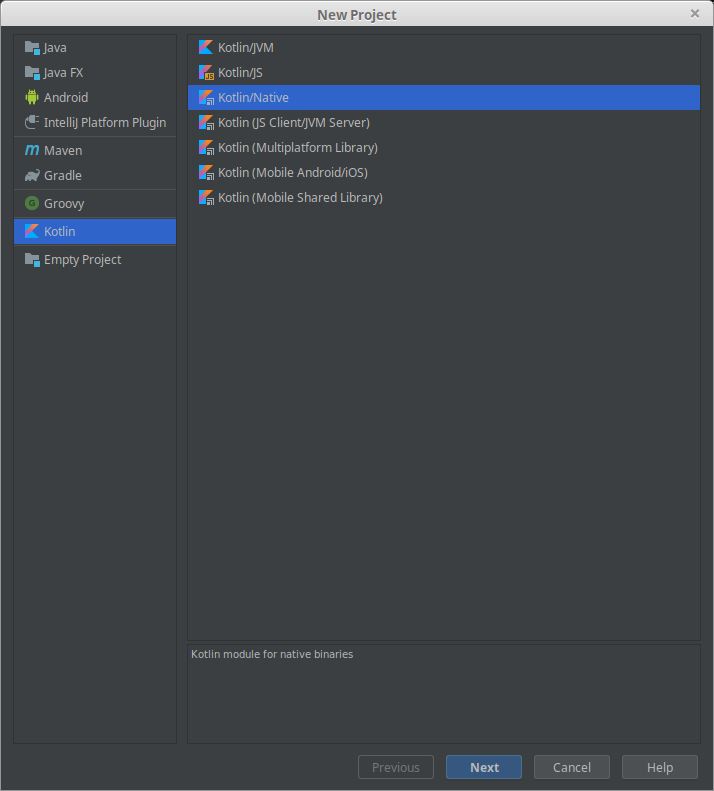

Select `Kotlin/Native` then click the next button.

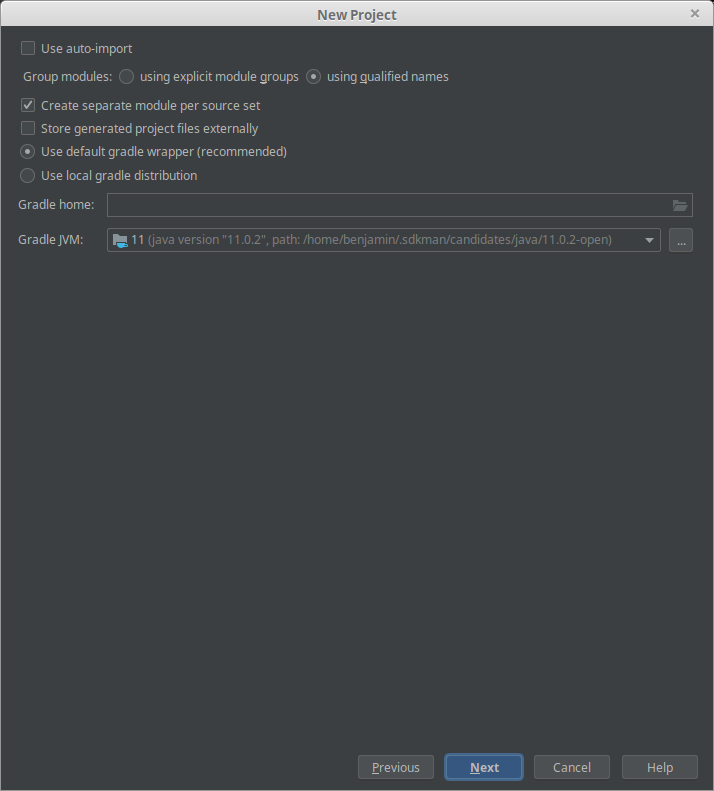

We don't need to do anything here, so click next again.

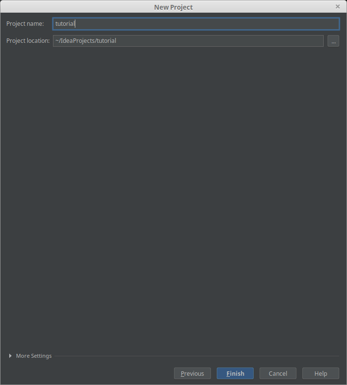

This is the screen where we give our project a name. We can also specify where on our computer we want it installed. I've chosen `tutorial` as the name for our project.

Once you've entered a name. Click `Finish`, and IntelliJ will create your new project.

IntelliJ will take some time to load, index, and sync your files, but you should end up with something like this.

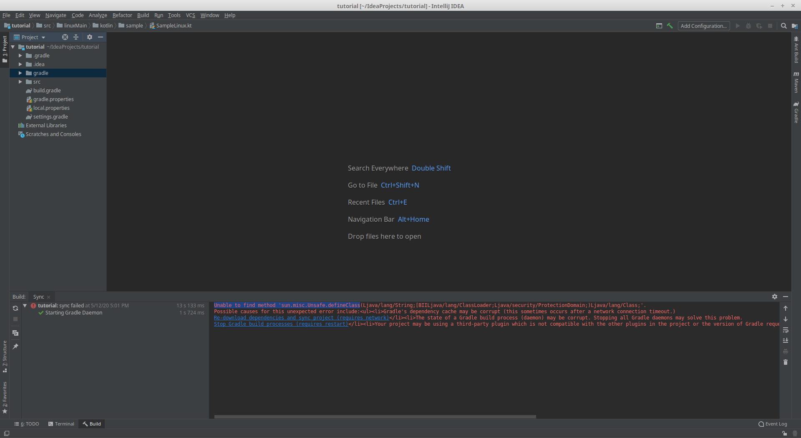

You may run into an error like the following.

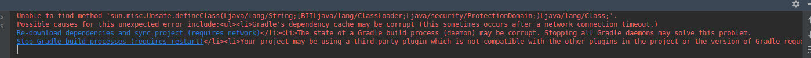

This can be easily fixed by going into the `gradle-wrapper.properties` file

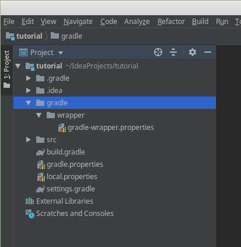

and changing the line with 

```properties
distributionUrl=https\://services.gradle.org/distributions/gradle-4.7-bin.zip
```

to use version 4.9 instead of 4.7.

```properties
distributionUrl=https\://services.gradle.org/distributions/gradle-4.9-bin.zip
```

You'll then have to click the refresh button in the bottom left panel of the screen in the Sync tab.

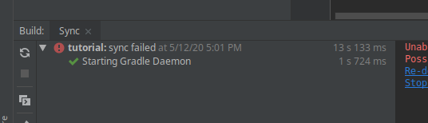

That will run for a bit. Once it's done you can start running code!

*If you need more help, check out [the documentation](https://www.jetbrains.com/help/idea/new-project-wizard.html#)*

## Where's the code?

You can find your code in the project panel under `src | <YOUR_PLATFORM>Main | kotlin | sample | Sample<YOUR_PLATFORM>`.

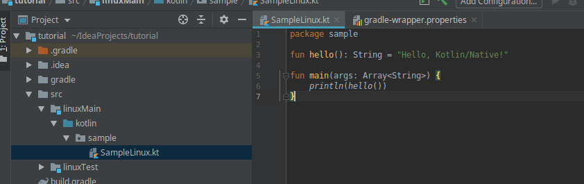

## How do I run it? (Gradle)

Kotlin projects are usually build using [Gradle](https://gradle.org/). We can configure how Gradle builds our project using the `build.gradle` file located in our `src` directory.

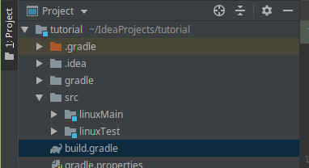

By default it should look something like this.

```groovy
plugins {
    id 'kotlin-multiplatform' version '1.3.11'
}
repositories {
    mavenCentral()
}
kotlin {
    targets {
        // For ARM, preset should be changed to presets.iosArm32 or presets.iosArm64
        // For Linux, preset should be changed to e.g. presets.linuxX64
        // For MacOS, preset should be changed to e.g. presets.macosX64
        fromPreset(presets.linuxX64, 'linux')

        configure([linux]) {
            // Comment to generate Kotlin/Native library (KLIB) instead of executable file:
            compilations.main.outputKinds('EXECUTABLE')
            // Change to specify fully qualified name of your application's entry point:
            compilations.main.entryPoint = 'sample.main'
        }
    }
    sourceSets {
        // Note: To enable common source sets please comment out 'kotlin.import.noCommonSourceSets' property
        // in gradle.properties file and re-import your project in IDE.
        linuxMain {
        }
        linuxTest {
        }
    }
}

task runProgram {
    def buildType = 'release' // Change to 'debug' to run application with debug symbols.
    dependsOn "link${buildType.capitalize()}ExecutableLinux"
    doLast {
        def programFile = kotlin.targets.linux.compilations.main.getBinary('EXECUTABLE', buildType)
        exec {
            executable programFile
            args ''
        }
    }
}
```

This file controls how our project is built. The exact details of this file will vary across platforms. They main thing we want to focus on is the `task runProgram` bit. This block is the code that will actually run the project. It will look a little different depending on the platform you're using.

There should be a little green play button next in the sidebar next to  `task runProgram`. Clicking this will run this task, and thus our program.

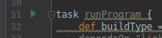

Running our program will output the following in the `Run:` panel at the bottom of the window.

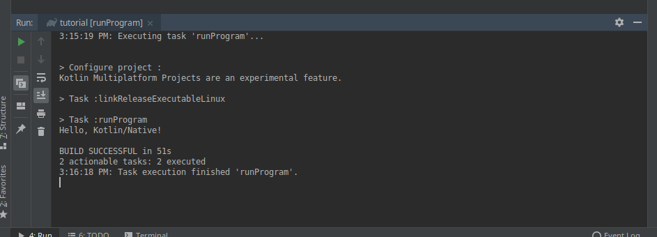

We can see under `> Task :runProgram` that it outputs `Hello, Kotlin/Native!`. If look at our sample code, `SampleLinux.kt` in my case we can see that this corresponds to the text between quotes on line 3.

```kotlin
fun hello(): String = "Hello, Kotlin/Native!"
```

Doing this also created a `run configuration` in the top-right of the window. 

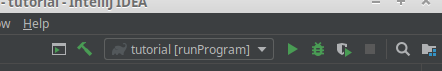

We can click the green play button up there to run our program again.

That's all we need to do for now. Next we'll talk about [how to store data in kotlin](/kotlin/types/).