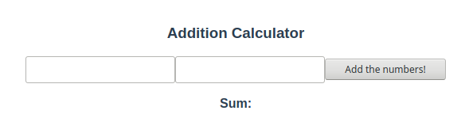
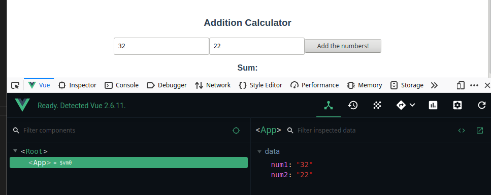
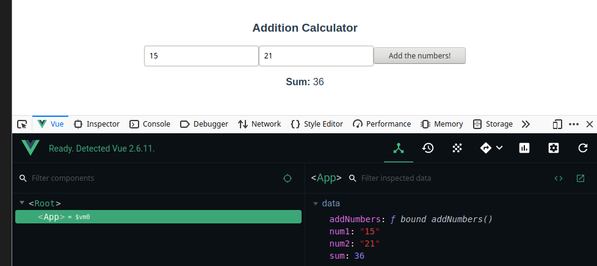

# Intro to VueJS

<div class="warning">

This example requires you to be comfortable with HTML, Javascript, CSS, and using NPM. Come back later if you need to review those.

</div>

There are a variety of web frameworks to choose from. One of my favorites (and the one I have the most experience with) is VueJS. VueJS is built around the concept of *reactivity*: if part of the UI changes, other parts will automatically change with it. In this example we'll create a basic calculator that adds up 2 numbers.

## Getting started

Create a Vue project called `adder`.

```bash
vue create adder
```

<div class="note">

If you don't have the `vue` command, you might want to check out the following link. [https://www.vuemastery.com/courses/real-world-vue-js/vue-cli/](https://www.vuemastery.com/courses/real-world-vue-js/vue-cli/)

</div>

Follow the onscreen prompts. You should be able to press `ENTER` for all of them. These prompts help you configure your project.

Next we're going to install the Composition API. This will make using Vue a little simpler.

```bash
npm install --save @vue/composition-api
```

We're going to need to modify the `main.rs` file inside the `src` folder as well. It should look something like this.

```javascript
import Vue from 'vue'
import VueCompositionApi from '@vue/composition-api';
import App from './App.vue'

Vue.config.productionTip = false

Vue.use(VueCompositionApi); // <-- we added this line

new Vue({
  render: h => h(App),
}).$mount('#app')
```

Now we can get started.

## Vue File Format

Open the `App.vue` file in the `src` folder. This is our app. Replace everything with the following.

```vue
<template>
  <div id="app">
  </div>
</template>

<script>
import { ref } from '@vue/composition-api';
export default {
  name: 'app',
}
</script>

<style>
#app {
  font-family: 'Avenir', Helvetica, Arial, sans-serif;
  -webkit-font-smoothing: antialiased;
  -moz-osx-font-smoothing: grayscale;
  text-align: center;
  color: #2c3e50;
  margin-top: 60px;
}
</style>
```

Vue files are split into 3 parts: the `template`, the `script`, and the `style`. 

### The Template

The template is the HTML content of this page (our app in this case). You can use normal HTML here, but we can also embed code from the script as well.

Let's modify the template to have a form with 2 number inputs and a button.

```vue
<template>
  <div id="app">
    <h3>Addition Calculator</h3>
    <form id="sumForm">
      <!-- We can use variables from our script using v-model -->
      <input type="text" class="form-control" v-model="num1">
      <input type="text" class="form-control" v-model="num2">
      <!-- The @click attribute will bind functions from our script -->
      <button @click="addNumbers" type="button" class="btn btn-light">
        Add the numbers!
      </button>
    </form>
    <!-- The {{ }} allows us to execute javascript inside our HTML-->
    <p><strong>Sum:</strong> {{ sum }}</p>
  </div>
</template>
```

You should get something like this.



## The Script

This is where the magic happens. Currently if we modify any of the number inputs and press `Add the numbers`, nothing happens. We need to write some code to make things work.

Let's modify the `export default` bit.

```javascript
export default {
  name: 'app',
  // NEW!
  setup() {
    return {

    }
  }
}
```

The `setup()` function is where we'll *setup* our app. The object we return will be the state of our app. Let's hook up our number inputs next.

```javascript
export default {
  name: 'app',
  setup() {
    let num1 = ref(0); // NEW!
    let num2 = ref(0); // NEW!

    return {
      num1, // NEW!
      num2, // NEW!
    }
  }
}
```

Now our two number inputs are hooked up. Wait, really? We barely did anything? It seems like magic, but it's not. Let's look at part of our template real quick.

```html
<!-- We can use variables from our script using v-model -->
<input type="text" class="form-control" v-model="num1">
<input type="text" class="form-control" v-model="num2">
```

The `v-model="num1"`, and `v-model="num2"` tell Vue to look for `num1`, and `num2` fields respectively on the object returned from setup. It's important that these be wrapped in `ref()` from `@vue/composition-api`, otherwise this won't work.

Now when ever these inputs get updated, the values in `num1` and `num2` will as well. If you open the web console, and look at the Vue Debugger, you can see the values changing when you change the inputs. (You may have to click on `<App>` to see the values change)



<div class="note">

You'll need the Vue DevTools to see the Vue Debugger. There are Chrome and Firefox extensions. You can check out more [here](https://github.com/vuejs/vue-devtools).

</div>

The `Sum: ` text at the bottom of the screen needs to be hooked up too.

```javascript
export default {
  name: 'app',
  setup() {
    let num1 = ref(0);
    let num2 = ref(0);
    let sum = ref(0); // NEW!

    return {
      num1,
      num2,
      sum, // NEW!
    }
  }
}
```

This will bind to the text at the bottom of the screen.

```html
<!-- The {{ }} allows us to execute javascript inside our HTML-->
<p><strong>Sum:</strong> {{ sum }}</p>
```

### Methods

In addition to `ref` fields, a Vue object can have methods as well. We can bind these to events in our `<template>` so they get called when certain events fire. The button in our `<template>` has an `@click` attribute set too `"addNumbers"`. Let's create that method.

```javascript
export default {
  name: 'app',
  setup() {
    let num1 = ref(0);
    let num2 = ref(0);
    let sum = ref(0);

    // NEW!
    function addNumbers() {
      sum.value = parseInt(num1.value) + parseInt(num2.value);
    }

    return {
      num1,
      num2,
      sum,
      addNumbers, // NEW!
    }
  }
}
```

<div class="note">

Since we've wrapped our variables in refs, we need to to use the `value` field to get at the inner value. There's a way we can get around this by using

</div>

With that done we can press our button and it will update the text at the bottom of the screen with the sum of the 2 numbers!



## Using `reactive` instead of `ref`

Using `ref.value` can be cumbersome. If our component becomes particularly complex it can get out of hand. You can get around this using `reactive`. The `reactive` function will make whatever object passed into it notify Vue whenever it's fields get changed, just like if each field were wrapped in a `ref`.

Our script would look like this with `reactive`.

```javascript
// UPDATED!
import { reactive, toRefs } from '@vue/composition-api';
export default {
  name: 'app',
  setup() {
    // UPDATED!
    let state = reactive({
      num1: 0,
      num2: 0,
      sum: 0,
    });

      // UPDATED!
    function addNumbers() {
      state.sum = parseInt(state.num1) + parseInt(state.num2);
    }

    // UPDATED!
    return {
      ...toRefs(state),
      addNumbers,
    }
  }
}
```

We need the `toRefs` function at the end to convert our reactive object to refs to get the app working without changing the template code. We could have also just done.

```javascript
return {
  state,
  addNumbers,
}
```

Though that would require use to use `state` in the template.

```html
<input type="text" class="form-control" v-model="state.num1">
```

<div class="warning">

Do not try to use `reactive` on primitive types such as ints, bools, or strings. It's designed to be used with object types only. The function attachs methods and fields to the object passed in which can't be done with primitive types.

</div>

## The Style

I won't go into this block much. If you haven't guessed already, this is where your CSS while go.

<div class="note">

If you've setup your Vue project to do so, you can use different styling languages here such as Sass and Less. A similar thing applies to the script and template blocks.

</div>